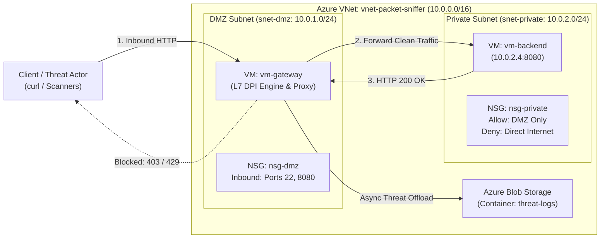

# Azure Cloud L7 Deep Packet Inspection (DPI) Gateway & Packet Sniffer

> An enterprise-grade, asynchronous Layer 7 Deep Packet Inspection (DPI) engine and reverse proxy deployed on Microsoft Azure. The gateway intercepts public HTTP traffic in a DMZ subnet, analyzes layer-7 payloads against regex signature profiles (SQL Injection, Cross-Site Scripting, and automated scanner user-agents), enforces sliding-window rate limiting, offloads threat telemetry asynchronously to Azure Blob Storage, and securely forwards clean traffic to an isolated backend tier.

---

## Architecture Overview

The system enforces network isolation by establishing a dual-subnet DMZ topology using Azure Virtual Network (VNet) security boundaries.



---

## Network Topology & Subnet Isolation

* **DMZ Subnet (`snet-dmz` | `10.0.1.0/24`):** Hosts `vm-gateway`, exposing port `8080` to public traffic and port `22` for remote administration.
* **Private Subnet (`snet-private` | `10.0.2.0/24`):** Hosts `vm-backend` (`10.0.2.4`). Possesses **no public IP address** and is strictly isolated by Network Security Group rules that drop direct inbound public internet requests.
* **Asynchronous Telemetry Pipeline:** When a malicious signature is matched, `vm-gateway` dispatches structured JSON log payloads non-blockingly to the Azure Blob Storage container (`threat-logs`).

---

## Key Features

1. **Layer 7 Deep Packet Inspection:** Parses incoming HTTP body payloads and URL-encoded query parameters for malicious signature patterns using regular expressions.
2. **Signature-Based Vulnerability Mitigation:**
   * **SQL Injection (SQLi):** Intercepts authentication bypass tautologies (`' OR '1'='1`), union-based queries (`UNION SELECT`), schema enumeration (`SELECT ... FROM`), and destructive commands (`DROP TABLE`).
   * **Cross-Site Scripting (XSS):** Blocks script tags (`<script>`), pseudo-protocols (`javascript:`), inline DOM event handlers (`onerror=`), and embedded malicious frames (`<iframe>`).
   * **Reconnaissance Scanner Probes:** Detects common automated assessment tools via `User-Agent` headers (e.g., `sqlmap`, `nikto`, `nmap`, `gobuster`, `dirbuster`).
3. **Sliding-Window Rate Limiting:** Enforces a token-bucket rate limiter capping requests at 10 requests per 10-second window per source IP, returning `HTTP 429 Too Many Requests`.
4. **Transparent Reverse Proxying:** Leverages Python's `asyncio` streams to open low-latency TCP sockets and proxy sanitized requests to the internal backend tier (`10.0.2.4:8080`).

---

## Repository Structure

```text
azure-cloud-dpi-sniffer/
├── docs/
│   └── images/              # Visual deployment proofs & attack mitigation evidence
├── infra/                  # Infrastructure specifications (JSON configuration schemas)
│   ├── vnet_config.json
│   ├── subnet_config.json
│   ├── nsg_rules.json
│   ├── vm_gateway_config.json
│   └── vm_backend_config.json
├── src/
│   └── gateway.py           # Core L7 DPI Engine, Proxy & Telemetry pipeline
└── tests/
    └── test_payload.sh      # Security verification & threat vector test suite
```
---

## Infrastructure Details

All cloud infrastructure parameters are modularly defined as JSON configuration schemas inside the [`infra/`](./infra) directory:

* **Network & Subnets (`vnet_config.json`, `subnet_config.json`):** Specifies the VNet address space (`10.0.0.0/16`) segmented into public DMZ (`10.0.1.0/24`) and private backend (`10.0.2.0/24`) tiers.
* **Security Policies (`nsg_rules.json`):** Defines Network Security Group rules, exposing ports `22` and `8080` on the DMZ while restricting private tier access strictly to internal DMZ traffic.


<sub>*NSG DMZ Inbound Rules*</sub>


<sub>*NSG Private Inbound Rules*</sub>

* **Compute Resources (`vm_gateway_config.json`, `vm_backend_config.json`):** Configures OS images, instance sizes, static/dynamic IP assignments, and authentication settings for both virtual machines.

---

## Deployment & Setup Guide

### Prerequisites
* Active Microsoft Azure Subscription.
* Azure CLI (`az`) installed and authenticated (`az login`).
* Local SSH RSA keypair (`~/.ssh/azure_gateway_key`).

### Step 1: Provision Cloud Resources
Provision the Resource Group, VNet, Subnets, NSGs, and VMs following the specifications mapped out in the [`infra/`](./infra) directory.


<sub>*Resource Group creation.*</sub>


<sub>*VM Gateway creation.*</sub>


<sub>*VM Backend creation.*</sub>

### Step 2: Deploy & Execute DPI Gateway
Copy `src/gateway.py` to `vm-gateway`, set up the connection string for Azure Blob Storage telemetry, and launch the service:

```bash
# Copy DPI Engine to Gateway VM
scp -i ~/.ssh/azure_gateway_key src/gateway.py azureuser@<GATEWAY_PUBLIC_IP>:~/

# SSH into Gateway VM
ssh -i ~/.ssh/azure_gateway_key azureuser@<GATEWAY_PUBLIC_IP>

# Set Azure Storage environment variable for async threat logging
export AZURE_STORAGE_CONNECTION_STRING="<YOUR_AZURE_STORAGE_CONNECTION_STRING>"

# Launch DPI Engine & Reverse Proxy
python3 gateway.py
```
---

## Test Suite Execution Output Breakdown

| Test Case | Payload / Condition | Expected Result | Mitigation Layer |
| :--- | :--- | :--- | :--- |
| **Legitimate Traffic** | `GET /` | `HTTP 200 OK` | Proxied to Backend (`10.0.2.4:8080`) |
| **SQL Injection (SQLi)** | `?id=1' OR '1'='1` | `HTTP 403 Forbidden` | Intercepted by L7 Regex Engine |
| **Cross-Site Scripting** | `?q=<script>alert(1)</script>` | `HTTP 403 Forbidden` | Intercepted by L7 Regex Engine |
| **Recon Scanner Probe** | `User-Agent: sqlmap/1.5.2` | `HTTP 403 Forbidden` | Scanner Signature Blacklist |
| **Rate Limiting** | `> 10 reqs / 10s window` | `HTTP 429 Too Many Requests` | Sliding Window Token Bucket |


<sub>*SQL Injection Mitigation*</sub>


<sub>*Rate Limiting*</sub>

---

## Author

**Sanjay Narayanan V**, 
Electronics and Communication Engineering

**Project:** Azure Cloud L7 Deep Packet Inspection (DPI) Gateway & Packet Sniffer

---

## License

This project is licensed under the MIT License.

---
